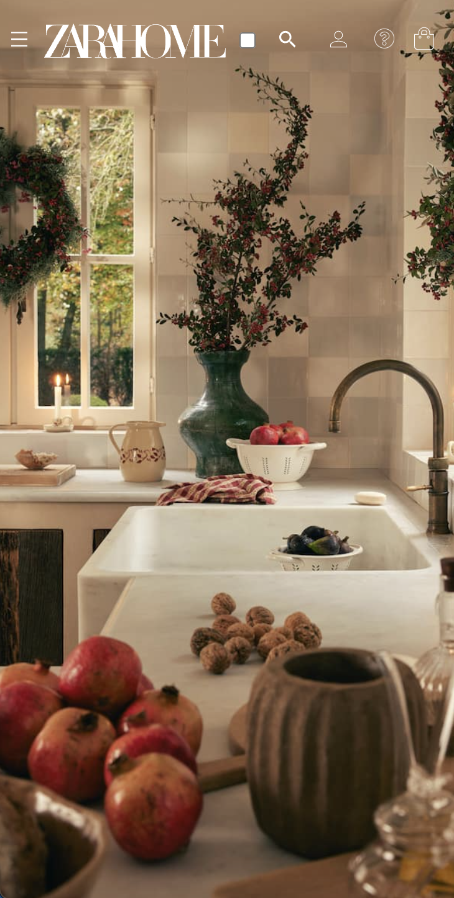

# Procesverslag
Markdown is een simpele manier om HTML te schrijven.  
Markdown cheat cheet: [Hulp bij het schrijven van Markdown](https://github.com/adam-p/markdown-here/wiki/Markdown-Cheatsheet).

Nb. De standaardstructuur en de spartaanse opmaak van de README.md zijn helemaal prima. Het gaat om de inhoud van je procesverslag. Besteedt de tijd voor pracht en praal aan je website.

Nb. Door *open* toe te voegen aan een *details* element kun je deze standaard open zetten. Fijn om dat steeds voor de relevante stuk(ken) te doen.

## Jij

  
uitwerken voor kick-off werkgroep

  ### Auteur:
  Roos ten Boekel

  #### Je startniveau:
  blauw

  #### Je focus:
  surface
 

## Je website

  
uitwerken voor kick-off werkgroep

  ### Je opdracht:
  https://www.zarahome.com/nl/

  #### Screenshot(s) van de eerste pagina (small screen): 
  startpagina Zara Home 
  

  #### Screenshot(s) van de tweede pagina (small screen):
  kerstpagina Zara Home
  
 

## Toegankelijkheidstest 1/2 (week 1)

  
uitwerken na test in 2e werkgroep

  ### Bevindingen
  Lijst met je bevindingen die in de test naar voren kwamen:

    alleen maar divs
    onlogische volgorde wanneer ik de voice-over aan deed
    geen aria-label bij foto's
    wel een heel toegankelijkheidsmenu waarbij je bijvoorbeeld kleuren en lettergrootte kan aanpassen
    

## Breakdownschets (week 1)

  
uitwerken na afloop 3e werkgroep

  ### Eerste pagina: 
  

  ### Eerste pagina footer: 
  

  ### Tweede pagina - detailpagina: 
  

## Voortgang 1 (week 2)

  
uitwerken voor 1e voortgang

  ### Stand van zaken
  hier dit ging goed & dit was lastig (neem ook screenshots op van delen van je website en code)

  ### Agenda voor meeting
  samen met je groepje opstellen

  | Roos    | Niels        | Younes   | Cecilia        |
  | ---            | ---                | ---          | ---              |
  | img onder header  | live foto             | menu recht onder elkaar    | header    |
  | 

  ### Verslag van meeting
  hier na afloop snel de uitkomsten van de meeting vastleggen

  - object:cover
  - Width en height op 100vw en vh

## Voortgang 2 (week 3)

  
uitwerken voor 2e voortgang

  ### Stand van zaken
  hier dit ging goed & dit was lastig (neem ook screenshots op van delen van je website en code)

  ### Agenda voor meeting
  samen met je groepje opstellen

  | Roos      | Niels          | Younes    | Cecilia        |
  | ---            | ---                | ---          | ---              |
  | header in footer zwart  | tekst uitschuiven bij hover             | img op plaats vergroten    | niet aanwezig    |
  | 

  ### Verslag van meeting
  hier na afloop snel de uitkomsten van de meeting vastleggen

  - caroussel codepen gebruiken
  - footer codepen gebruiken

## Toegankelijkheidstest 2/2 (week 4)

  
uitwerken na test in 9e werkgroep

  ### Bevindingen
  Lijst met je bevindingen die in de test naar voren kwamen (geef ook aan wat er verbeterd is):

    bijna overal arialabel toegevoegd, moet nog de :focus toevoegen

## Voortgang 3 (week 4)

  
uitwerken voor 3e voortgang

  ### Stand van zaken
  hier dit ging goed & dit was lastig (neem ook screenshots op van delen van je website en code)

  ### Agenda voor meeting
  samen met je groepje opstellen

  | Roos      | Niels          | Younes    | Cecilia       |
  | ---            | ---                | ---          | ---              |
  | account nav vanuit midden zoomen  | nav bij groter scherm             | niet aanwezig    | niet aanwezig    |
  | input sticky maken |  |  |  |
  | 

  ### Verslag van meeting
  hier na afloop snel de uitkomsten van de meeting vastleggen

  - position: sticky
  - scale gebruiken ipv width en height

## Eindgesprek (week 5)

  
uitwerken voor eindgesprek

  ### Je uitkomst - karakteristiek screenshots:
  
  
  

  ### Dit ging goed/Heb ik geleerd: 
    Ik ben trots op de schermen die binnenkomen schuiven/zoomen

  

  ### Dit was lastig/Is niet gelukt:
    als je op "aan winkelmand toevoegen" klikt dat hij dan niet aan het winkelmandje toevoegt. laatste moment kwam ik er achter dat ik dat nog moest doen maar heb niet kunnen vinden hoe dat moest.

  

## Bronnenlijst

  
continu bijhouden terwijl je werkt

  Nb. Wees specifiek ('css-tricks' als bron is bijv. niet specifiek genoeg). 
  Nb. ChatGpT en andere AI horen er ook bij.
  Nb. Vermeld de bronnen ook in je code.

  1. https://developer.mozilla.org/en-US/docs/Web/HTML/Element/input/email
  2. https://stackoverflow.com/questions/37465458/input-text-field-with-only-bottom-border
  3. https://developer.mozilla.org/en-US/docs/Web/CSS/@font-face
  4. veel hulp van Sanne en studentassistenten

